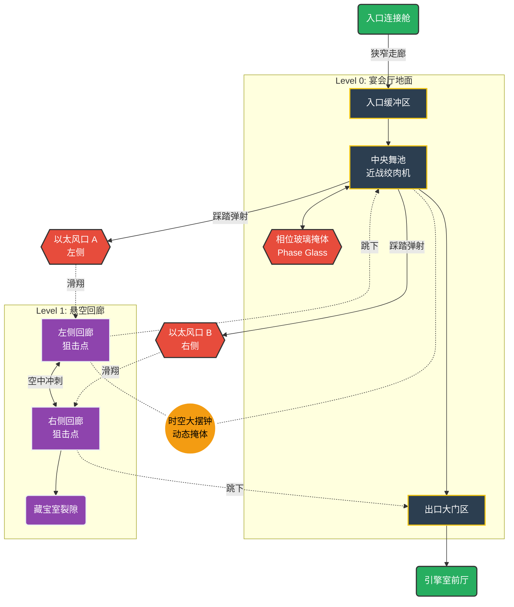
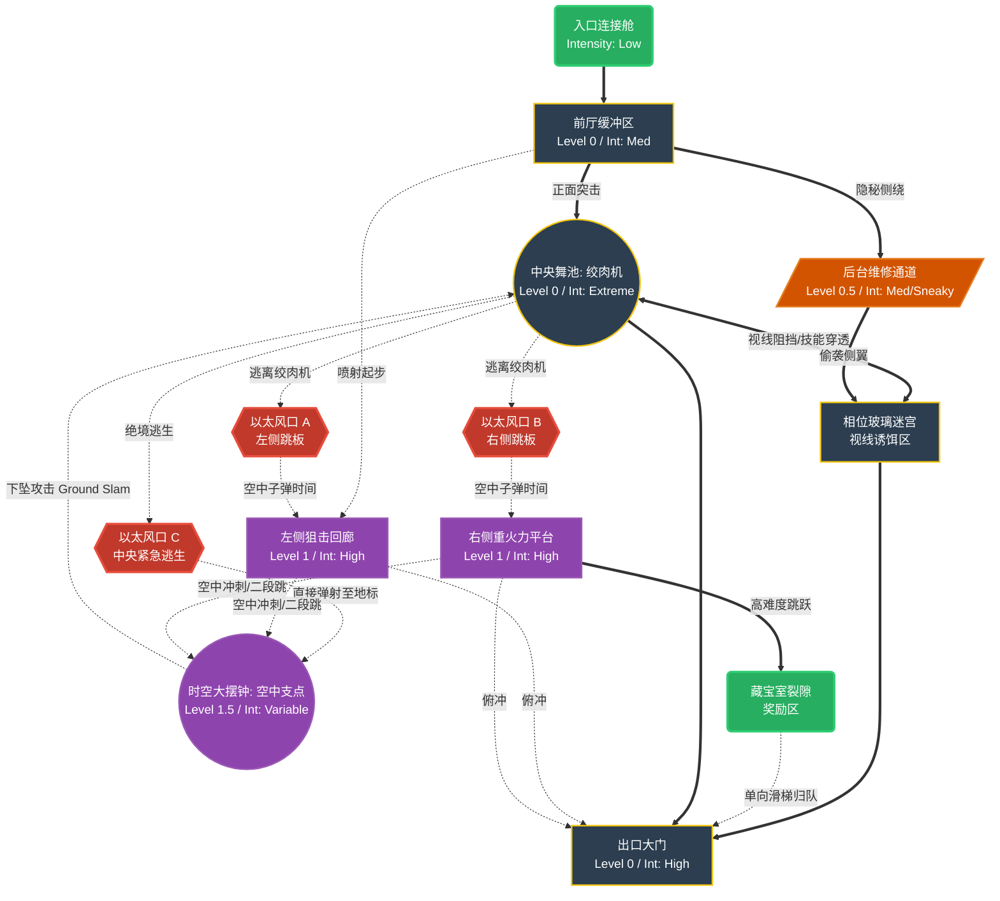

# Welcome to My Blog

This is the English content of my first blog post.

## Introduction

I am testing the **markdown rendering** capabilities.

### Features

- [x] Markdown parsing
- [x] i18n support
- [x] Custom styling

Here is some code:

```javascript
console.log("Hello, World!");
```
# LD-21 Topology



第二版：



‍

‍

‍

‍
