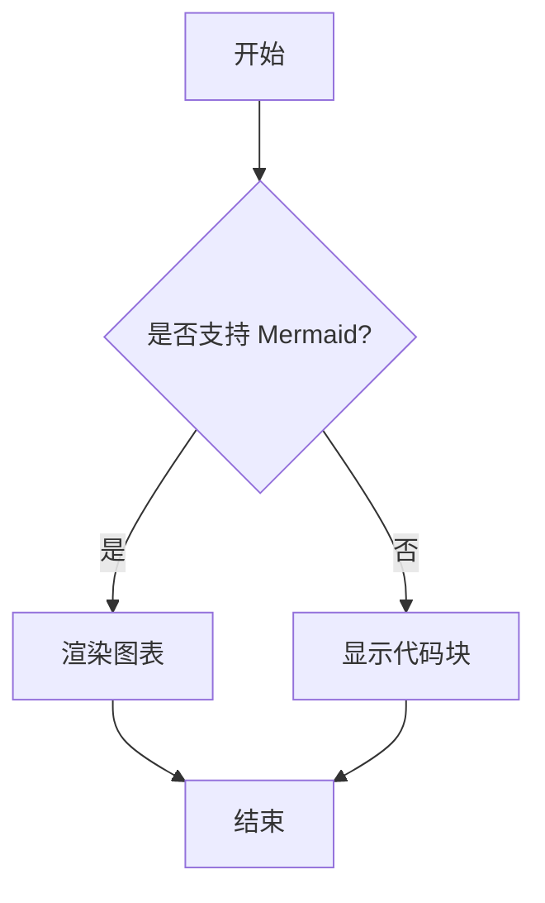
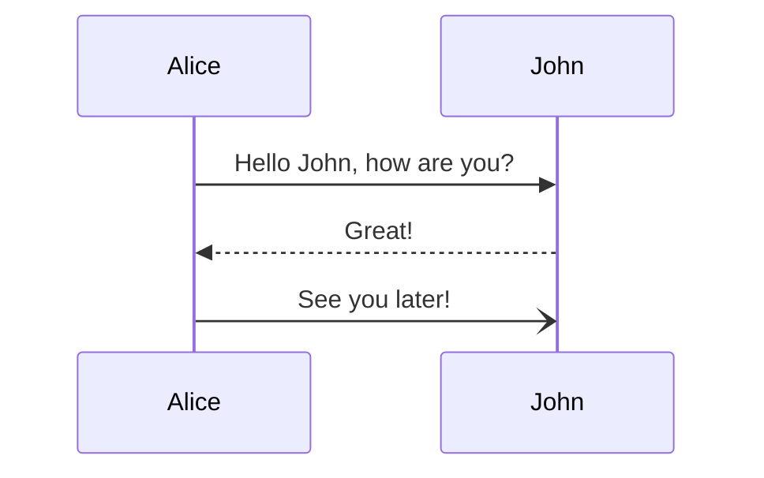

# 欢迎来到我的博客

这是我第一篇博客的中文内容。

## 简介

我正在测试 **Markdown 渲染** 功能。

### 功能列表

- [x] Markdown 解析
- [x] 多语言支持
- [x] 自定义样式

下面是一段代码：

```javascript
console.log("你好，世界！");
```

## 表格测试

| 功能 | 状态 | 备注 |
| --- | --- | --- |
| 表格渲染 | ✅ | 使用 remark-gfm |
| 代码高亮 | ✅ | 使用 rehype-highlight |
| Mermaid | ⏳ | 正在开发中 |

## Mermaid 图表测试




