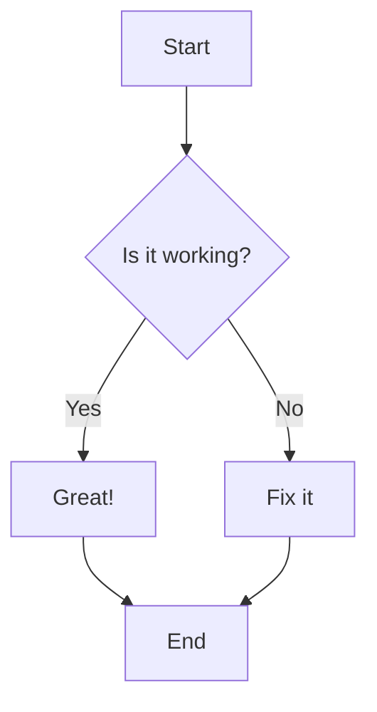

# Test Blog Post

This is a test blog post to verify the automated blog parser functionality.

## Introduction

The automated blog parser should be able to:

1. Parse zip files in the `content/pak` directory
2. Validate the extracted files
3. Handle duplicate blog posts
4. Process Mermaid diagrams correctly

## Mermaid Test

Here's a test Mermaid diagram:



## Code Example

```javascript
// This is a simple JavaScript example
function testBlogParser() {
    console.log('Testing blog parser...');
    return true;
}
```

## Conclusion

This test blog post should be successfully parsed and displayed on the website.