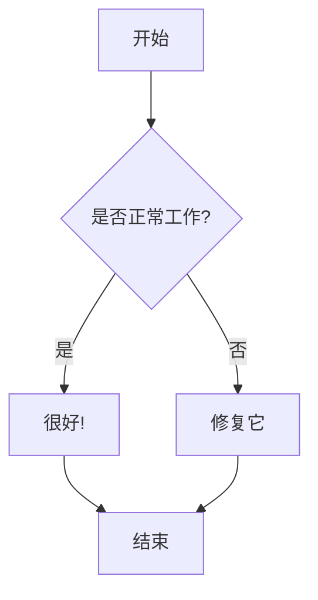

# 测试博客文章

这是一篇测试博客文章，用于验证自动博客解析器的功能。

## 介绍

自动博客解析器应该能够：

1. 解析 `content/pak` 目录中的 zip 文件
2. 验证解压后的文件
3. 处理重复的博客文章
4. 正确处理 Mermaid 图表

## Mermaid 测试

这是一个测试用的 Mermaid 图表：



## 代码示例

```javascript
// 这是一个简单的 JavaScript 示例
function testBlogParser() {
    console.log('测试博客解析器...');
    return true;
}
```

## 结论

这篇测试博客文章应该能够被成功解析并显示在网站上。