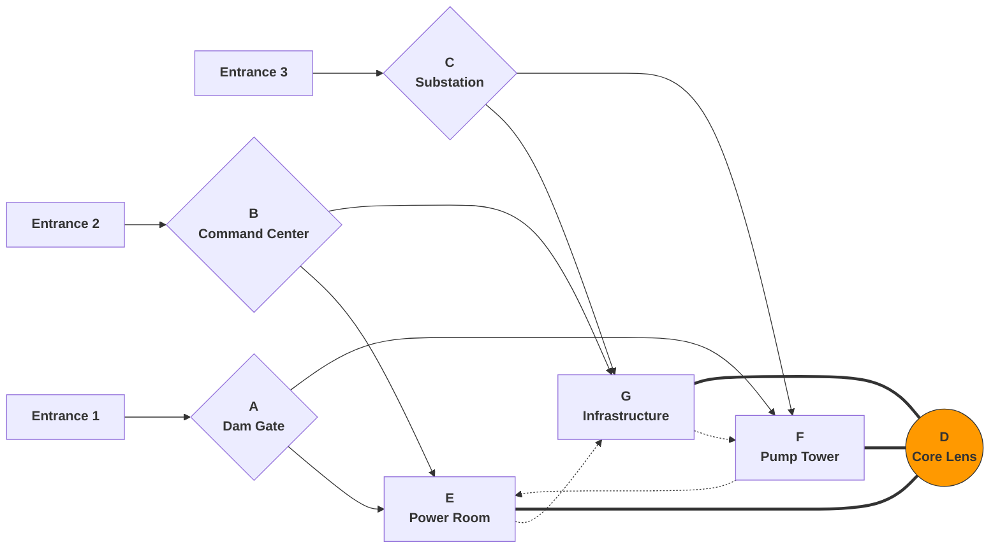

# One Pager

### FOCAL: One Pager

> *Located at the fault boundary similar to the North China Plain and Qinling fold belt, a massive energy hub covering approximately 1 square kilometer is embedded in the fragmented landscape with crisscrossing gullies. The spherical microwave antenna at the center of the hub is the focal point of the entire facility (Focal).*

##### Core Principle: **Three-faction stronghold牵制-based** high-mobility vertical combat space design

##### Basic Attributes

|Attribute|Details|
| :-------------------------| :----------------------------------------------------------------------------------------------------------------------------------------------------------------------------: |
|Perspective|FPP|
|Type|First-person shooter (FPS)|
|Mobility|High|
|Level Area|Approximately 0.53 square kilometers|
|Maximum Crossing Distance (straight line measurement)|1.1 kilometers|
|Maximum Map Elevation Difference|96 meters|
|Compatible Game Modes|Titan vs Titan (capture points, TDM) Pilot vs Pilot (traditional Titanfall PVP modes do not include the entire map area, full large map modes are similar to Battlefield's breakthrough mode & king of the hill & capture the flag, with more players compared to traditional modes)|
|PVP Mode Features|**Three teams mutually hostile**, **dynamic gameplay, increased chaos**|
|PVE Mode Features|**AI teams besieging the harvester will have greater attack angles and strategic depth**, players will be exhausted if not careful|
|Art Style|Building complex framework is brutalist with concrete + megastructural industrial facilities, while precision facilities such as antenna lenses, steam turbines, control centers are futuristic style|

##### Features

* **High altitude differences create vertical depth and Z-axis layering**
* **Spatial construction and area connections designed around high mobility**
* **Asymmetric design experience planning**

##### Overall Layout and Legend Description:

‍