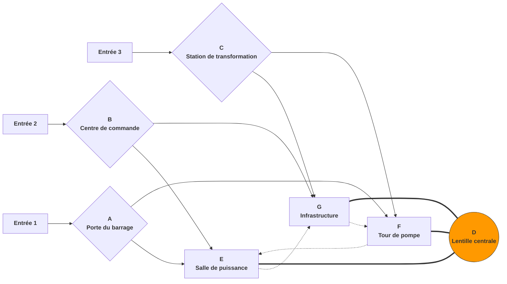

# Un Pager

### FOCAL: Un Pager

> *Situé à la frontière de faille similaire à la plaine du Nord de la Chine et la ceinture de repli du Qinling, un vaste centre d'énergie couvrant environ 1 kilomètre carré est incrusté dans un paysage fragmenté avec des ravins en réseau. L'antenne microwaves sphérique au centre du centre est le point focal de toute l'installation (Focal).*

##### Principe central : Conception d'espace de combat vertical tridimensionnel à haute mobilité **basée sur la牵制 de points forts tripartite**

##### Attributs de base

|Attribut|Détails|
| :-------------------------| :----------------------------------------------------------------------------------------------------------------------------------------------------------------------------: |
|Perspective|FPP|
|Type|Tireur à la première personne (FPS)|
|Mobilité|Haute|
|Surface du niveau|Environ 0,53 kilomètre carré|
|Distance de traversée maximale (mesure en ligne droite)|1,1 kilomètre|
|Différence d'altitude maximale de la carte|96 mètres|
|Modes de jeu compatibles|Titan vs Titan (capture de points, TDM) Pilot vs Pilot (les modes PVP traditionnels de Titanfall n'incluent pas toute la zone de la carte, les modes de grande carte complète sont similaires au mode percée de Battlefield & roi de la colline & capture de positions, avec plus de joueurs que les modes traditionnels)|
|Caractéristiques du mode PVP|**Trois équipes mutuellement hostiles**, **jeu dynamique, augmentation du chaos**|
|Caractéristiques du mode PVE|**Les équipes AI assiégeant la moissonneuse disposeront d'angles d'attaque et d'une profondeur stratégique plus grands**, les joueurs seront épuisés s'ils ne font pas attention|
|Style artistique|La structure du complexe architectural est brutaliste avec béton + installations industrielles mégastructurales, tandis que les installations de précision telles que les lentilles d'antenne, les turbines à vapeur, les centres de contrôle sont de style futuriste|

##### Caractéristiques

* **Différences d'altitude élevées créant une profondeur verticale et un stratification de l'axe Z**
* **Construction spatiale et connexions de zone conçues autour d'une haute mobilité**
* **Planification d'expérience de conception asymétrique**

##### Disposition globale et description de la légende :

‍