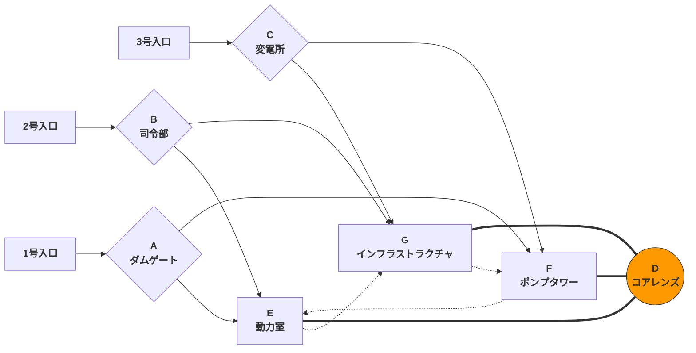

# ワンページ

### FOCAL: ワンページ

> *華北平原と秦嶺褶曲帯に似た断層境界に位置し、沟壑が縦横に走る断片化された景観に、約1平方キロメートルを占める巨大なエネルギーハブが埋め込まれている。ハブの中心にある球形マイクロ波アンテナは、施設全体の焦点（Focal）である。*

##### コアプリンシプル：**三方勢力の拠点牽制に基づく**高機動性垂直立体戦闘空間デザイン

##### 基本属性

|属性|詳細|
| :-------------------------| :----------------------------------------------------------------------------------------------------------------------------------------------------------------------------: |
|視点|FPP|
|タイプ|一人称シューター（FPS）|
|機動性|高|
|レベル面積|約0.53平方キロメートル|
|最大移動距離（直線測定）|1.1キロメートル|
|最大地図高低差|96メートル|
|対応ゲームモード|Titan vs Titan（拠点制圧、TDM） Pilot vs Pilot（伝統的なTitanfall PVPモードはマップ全体を含まず、完全な大規模マップのモードはバトルフィールドの突破モード＆丘の王＆陣地確保に似ており、伝統的なモードと比較してプレイヤー数が多い）|
|PVPモードの特徴|**三チームが相互に敵対**、**動的なゲームプレイ、混沌度の向上**|
|PVEモードの特徴|**収穫機を包囲するAIチームはより大きな攻撃角度と戦略的深さを持つ**、プレイヤーは注意しないと疲れ果てる|
|美術スタイル|建築群のフレームワークはコンクリート+巨大構造物のブルタリスト様式で、アンテナレンズ、蒸気タービン、制御センターなどの精密施設は未来主義的様式|

##### 特徴

* **高い標高差による垂直的深さとZ軸の層別化**
* **高機動性を中心に設計された空間構築とエリア接続**
* **非対称設計の体験プランニング**

##### 全体レイアウトと凡例説明：

‍