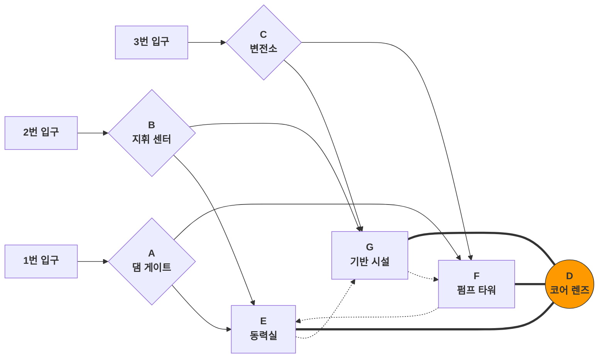

# 원 페이저

### FOCAL: 원 페이저

> *화북 평원과 진릉 주름대에 유사한 단층 경계에 위치하여, 골짜기가 가로질러 있는 파편화된 경관에 약 1평방킬로미터를 차지하는 거대한 에너지 허브가 매립되어 있다. 허브 중심의 구형 마이크로파 안테나는 시설 전체의 초점(Focal)이다.*

##### 핵심 원칙: **세 진영 기지 견제 기반**의 고기동성 수직 입체 전투 공간 디자인

##### 기본 속성

|속성|상세|
| :-------------------------| :----------------------------------------------------------------------------------------------------------------------------------------------------------------------------: |
|시점|FPP|
|타입|일인칭 슈터(FPS)|
|기동성|높음|
|레벨 면적|약 0.53평방킬로미터|
|최대 이동 거리(직선 측정)|1.1킬로미터|
|최대 맵 고저차|96미터|
|호환 게임 모드|Titan vs Titan(기지 점령, TDM) Pilot vs Pilot(전통적인 타이탄폴 PVP 모드는 맵 전체를 포함하지 않으며, 완전한 대형 맵 모드는 배틀필드의 돌파 모드 & 언덕의 왕 & 진영 확보와 유사하며 전통적인 모드에 비해 플레이어 수가 더 많음)|
|PVP 모드 특징|**세 팀이 상호 적대**、**동적 게임 플레이, 혼돈도 향상**|
|PVE 모드 특징|**수확기를 포위하는 AI 팀은 더 큰 공격 각도와 전략적 심도를 가지며**、플레이어가 주의를 기울이지 않으면 지치게 됨|
|미술 스타일|건축물 프레임워크는 콘크리트 + 거대 구조 산업 시설의 브루탈리스트 양식이며, 안테나 렌즈、증기 터빈、제어 센터와 같은 정밀 시설은 미래주의 양식|

##### 특징

* **높은 고도 차이로 인한 수직 심도와 Z축 계층화**
* **고기동성을 중심으로 설계된 공간 구축과 영역 연결**
* **비대칭 디자인 경험 계획**

##### 전체 레이아웃 및 범례 설명:

‍