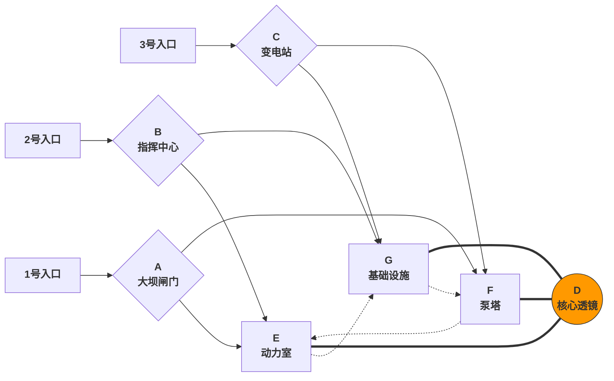

# One Pager

### FOCAL：One Pager

> *地处类似华北平原与秦岭褶皱带的断层交界，沟壑纵横的破碎地貌上嵌着一座*​***占地约 1 平方公里***​*的巨型能源枢纽，枢纽中心的球形微波天线是整个设施的焦点（Focal）*

##### 核心原则：**基于三方阵营据点牵制**的高机动性垂直立体战斗空间设计

##### 简要属性

|属性|详情|
| :-------------------------| :----------------------------------------------------------------------------------------------------------------------------------------------------------------------------: |
|视角|FPP|
|类型|第一人称射击（FPS）|
|机动性能|高|
|关卡占地面积|约 0.53 平方公里|
|最长跨越距离（直线测算）|1.1 公里|
|最高地图落差|96 米|
|适配的游戏模式|Titan vs Titan （占领据点、TDM） Pilot vs Pilot（传统泰坦陨落 PVP模式不包括整个地图区块，完整大地图的模式类似战地的突破模式&山丘之王&抢夺阵地，相较于传统模式下的玩家更多）|
|PVP 模式下特点|**三支队伍相互敌对**，**动态博弈，提升混沌度**|
|PVE 模式下特点|**围攻采集机的 Ai 队伍将拥有更大的进攻角度和战略纵深**，玩家稍有不慎会疲于奔命。|
|美术风格|建筑群框架为混凝土+巨构工业设施的粗野主义、其中的精密设施如天线透镜、蒸汽轮机、控制中心等是未来主义风格|

##### 特性

* **高海拔落差营造垂直纵深和 Z 轴分层**
* **围绕高机动性设计的空间构建与区域链接**
* **非对称性设计的体验规划**

##### 整体布局与图例简述：

​​

‍
