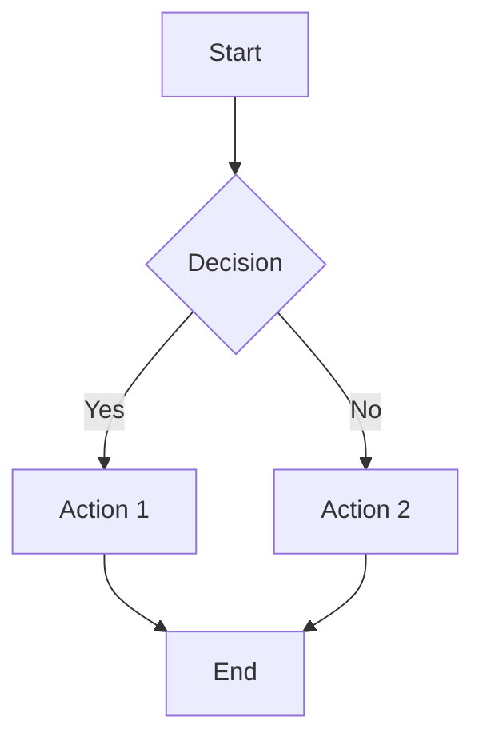

# Sample Project

This is a sample project demonstrating the project detail page functionality.

## Overview

This project showcases the features of our project detail page, including:

- Responsive design for desktop and mobile
- Tab-based navigation for overview and content
- Markdown content rendering with syntax highlighting
- Table of contents for easy navigation
- Mobile-friendly bottom floating menu

## Features

### Desktop Layout

On desktop screens, the page displays a two-column layout:

- **Left Column (1/4 width)**: Contains the tab navigation with Overview and Content tabs
  - Overview tab: Shows project type, tags, licenses, and video link
  - Content tab: Displays the table of contents
- **Right Column (3/4 width)**: Displays the main content rendered from Markdown

### Mobile Layout

On mobile devices, the layout adapts to provide a better user experience:

- Full-width content display
- Bottom floating menu button to access navigation
- Sheet component that slides up from the bottom
- Contains the same tab navigation as desktop

## Technical Details

### Fonts

The project detail page uses **Noto Sans** (思源黑体) for rendering content, which provides excellent CJK (Chinese, Japanese, Korean) character support. This is different from the blog pages, which use Noto Serif (思源宋体).

### Markdown Rendering

The content is rendered using `react-markdown` with the following plugins:

- `remark-gfm`: GitHub Flavored Markdown support
- `rehype-highlight`: Code syntax highlighting
- `rehype-slug`: Automatic heading ID generation for anchor links

### Components

The page uses several shadcn UI components:

- **Tabs**: For switching between Overview and Content views
- **Sheet**: Mobile bottom sheet for navigation
- **Button**: For various interactive elements
- **Separator**: For visual separation of content

## Code Example

Here's an example of code syntax highlighting:

```javascript
function greet(name) {
  return `Hello, ${name}!`;
}

console.log(greet("World"));
```

## Mermaid Diagrams

The page also supports Mermaid diagrams:



## Conclusion

This sample project demonstrates all the key features of the project detail page. Feel free to explore the different tabs and navigate through the content using the table of contents.