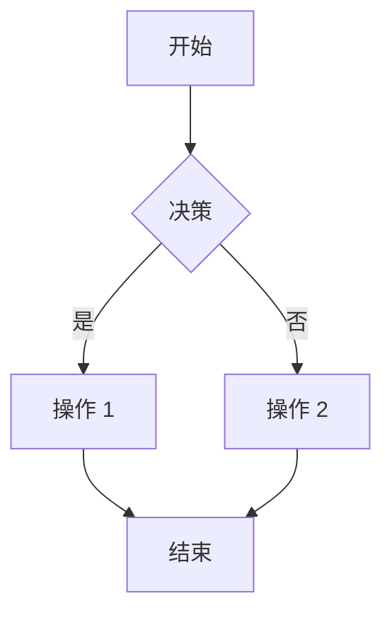

# 示例项目

这是一个演示项目详情页面功能的示例项目。

## 概述

本项目展示了我们的项目详情页面的功能，包括：

- 响应式设计，支持桌面和移动设备
- 基于标签页的导航，包含概览和内容两个标签
- Markdown 内容渲染，支持语法高亮
- 目录导航，方便快速跳转
- 移动端友好的底部悬浮菜单

## 功能特性

### 桌面版布局

在桌面屏幕上，页面显示双栏布局：

- **左侧栏（1/4 宽度）**：包含标签页导航，有概览和内容两个标签
  - 概览标签：显示项目类型、标签、许可证和视频链接
  - 内容标签：显示目录
- **右侧栏（3/4 宽度）**：显示从 Markdown 渲染的主要内容

### 移动版布局

在移动设备上，布局会调整以提供更好的用户体验：

- 全宽内容显示
- 底部悬浮菜单按钮，用于访问导航
- 从底部滑出的 Sheet 组件
- 包含与桌面版相同的标签页导航

## 技术细节

### 字体

项目详情页面使用 **Noto Sans**（思源黑体）渲染内容，提供了优秀的 CJK（中文、日文、韩文）字符支持。这与使用 Noto Serif（思源宋体）的博客页面不同。

### Markdown 渲染

内容使用 `react-markdown` 渲染，配合以下插件：

- `remark-gfm`：GitHub 风格 Markdown 支持
- `rehype-highlight`：代码语法高亮
- `rehype-slug`：自动为标题生成锚点 ID

### 组件

页面使用了多个 shadcn UI 组件：

- **Tabs**：用于在概览和内容视图之间切换
- **Sheet**：移动端底部导航抽屉
- **Button**：用于各种交互元素
- **Separator**：用于内容的视觉分隔

## 代码示例

以下是代码语法高亮的示例：

```javascript
function greet(name) {
  return `你好，${name}！`;
}

console.log(greet("世界"));
```

## Mermaid 图表

页面还支持 Mermaid 图表：



## 总结

这个示例项目展示了项目详情页面的所有关键功能。请随意探索不同的标签页，并使用目录导航浏览内容。